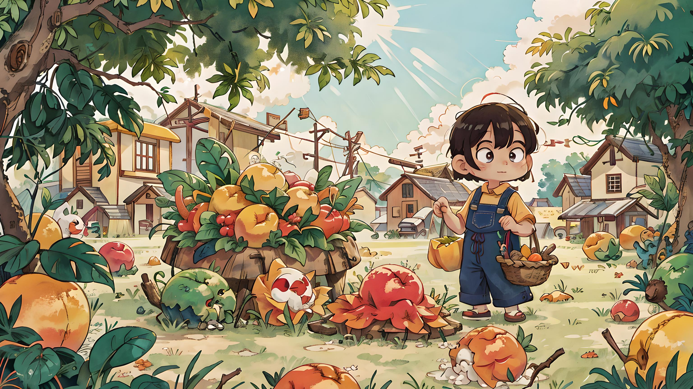
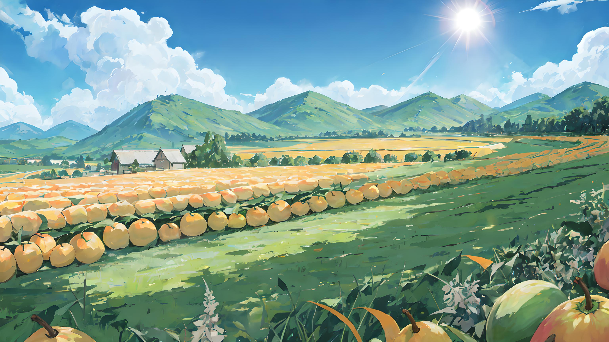
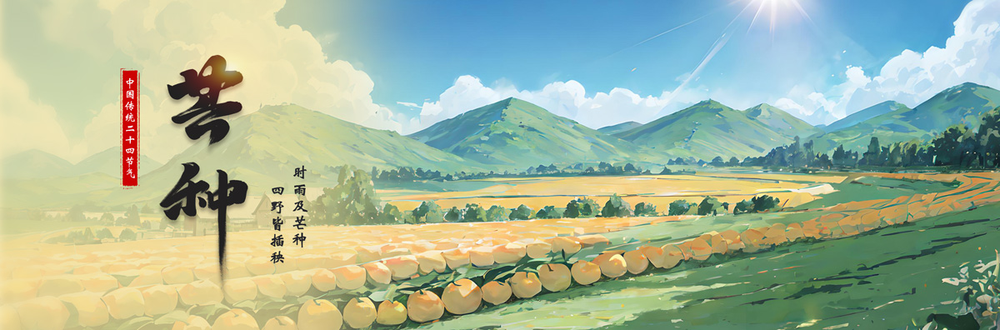

# AI生成芒种节气图片

这是对AI绘画功能的初次尝试，我们使用[无界AI](https://www.wujieai.com/ai)进行绘画

输入
```text
画面描述：夏天 芒种 水稻 太阳 农田
画面大小 16：9 3072*1728
风景-青山有思
```

输出


*目前来说有一种农民的感觉，但是我要求生成风景图，甲方要求不要人物，而且尽量清爽，所以有了新的提示词*

输入

```text
画面描述：夏天 芒种 水稻 太阳 农田 不要人物
画面大小 16：9 3072*1728
风景-碧山绿绮
```

输出


*好，虽然少了一些元素，但至少第一眼看上去不错，可以继续做其他的了！*

接下来就是我自己的事情了，加一些文字和甲方准备好的文案，就可以了


**虽然AI生成的图并不总能一下子令人满意，但只要告诉它你想要的元素，并不断尝试，总会创造出令人满意的作品，这就是AI绘画的魅力所在！**